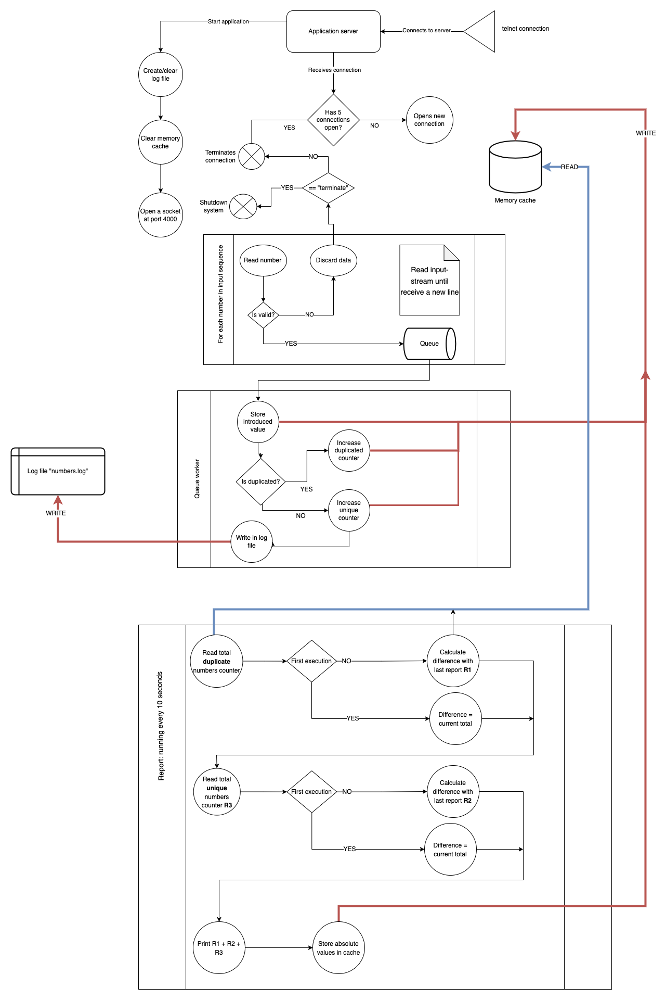

# Number server

## Description
- This application runs a concurrent server on the background that supports two-bidding connections via TCP. 
- It supports only 9 digit numbers, and any invalid input will conclude closing the client connection.
- No more than 5 concurrent clients can be connected.

## Diagram flow
Please check the following diagram to have a clear vision of the process flow from each request coming into the server:

## How client connections send data?
- This application takes advantage of the [Kotlin Coroutines](https://kotlin.github.io/kotlinx.coroutines/kotlinx-coroutines-core/kotlinx.coroutines.channels/actor.html) to be able to send messages between processes that opened connections to the main thread.
- The client sends the received and validated data to a dispatcher.
- The dispatcher is connected to an [Actor](https://kotlin.github.io/kotlinx.coroutines/kotlinx-coroutines-core/kotlinx.coroutines.channels/actor.html), which acts as a messaging queue.
- This actor sends the data to a worker (called `ClientConnectionHandler`) which handles the data.

## Tests
The domain logic of the application has been tested using the [JUnit](https://kotlinlang.org/docs/jvm-test-using-junit.html) library. The implementation details were not tested, such as validating that the socket reads the provided input.
